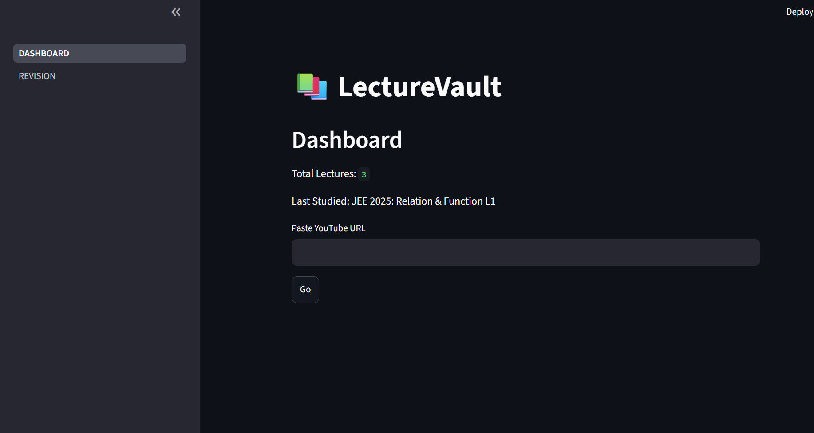
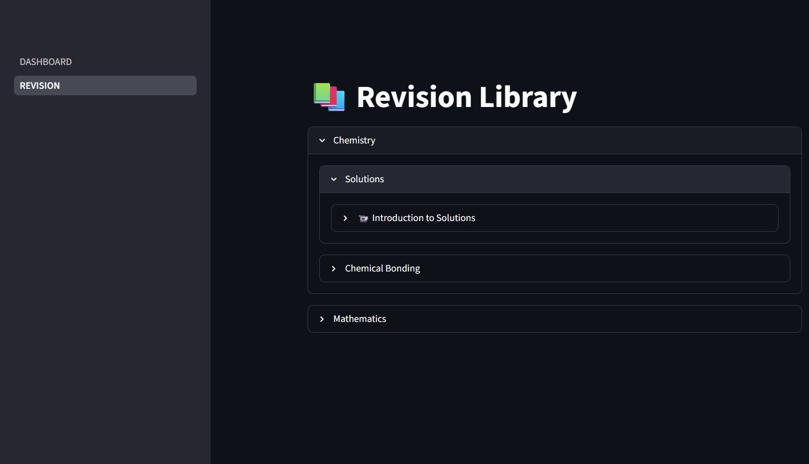
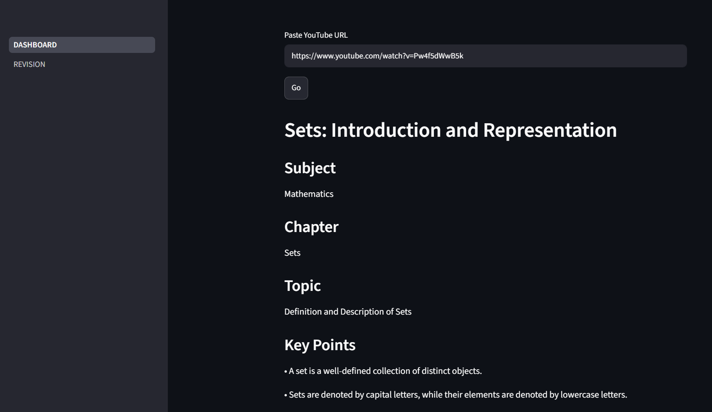

# 📚 LectureVault

**LectureVault** is an AI-powered study assistant that helps students organize YouTube lectures into structured revision notes. Users simply paste a YouTube lecture URL, and the application automatically extracts the transcript, analyzes it using Google's Gemini AI, and stores organized notes for future revision.

---

## ✨ Features

* 🎥 Analyze YouTube lecture videos
* 📝 Automatically extract video transcripts
* 🤖 Generate AI-powered structured study notes
* 📚 Organize lectures by **Subject → Chapter → Lecture**
* 🔍 Revision Library with expandable lecture notes
* 📅 Save study history for future revision
* 🚫 Prevent duplicate lecture entries

---

## 🛠️ Tech Stack

* Python
* Streamlit
* Google Gemini API
* YouTube Transcript API
* JSON
* Python Dotenv

---

## 📂 Project Structure

```text
LectureVault/
│
├── stream.py
├── tracker.py
├── history.json
├── requirements.txt
├── README.md
└── pages/
    └── 1_Revision.py
```

---

## 🚀 Getting Started

### 1. Clone the repository

```bash
git clone https://github.com/yourusername/LectureVault.git
```

### 2. Install dependencies

```bash
pip install -r requirements.txt
```

### 3. Create a `.env` file

```env
GEMINI_API_KEY=YOUR_API_KEY
```

Get a free Gemini API key from Google AI Studio.

### 4. Run the application

```bash
streamlit run stream.py
```

---

## 📸 Screenshots

## Home Page



## Revision Library



---
## Lecture Details



---
## 🔮 Future Improvements

* User authentication
* Cloud database support
* Search functionality
* Progress dashboard
* PDF export for notes
* Multi-user support

---

## 👨‍💻 Author

**Arnav Upadhyay**

If you found this project useful, consider giving it a ⭐ on GitHub.
